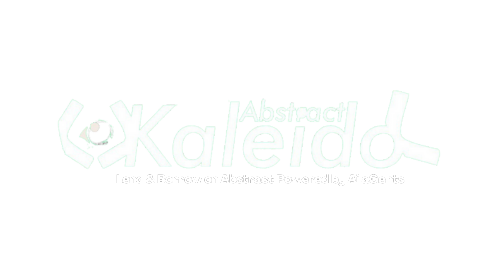

# Kaleido Agentic OS: The Autonomous Financial Layer



## Overview

**Kaleido Agentic OS** is the world's first **Unified DeFi Operating System** designed for the age of autonomous agents. Built on the **EIP-2535 Diamond Standard**, Kaleido transforms passive liquidity into an active execution environment where humans and AI agents (powered by **Luca**) interact seamlessly.

Our mission is to provide an intelligent, modular liquidity layer on the **Abstract Chain**, merging high-performance DeFi primitives with a native reasoning engine.

---

## Key Pillars

### 1. Agentic Execution (Luca AI)
Luca is the heartbeat of the OS. More than a bot, Luca is a **native co-pilot** that facilitates:
*   **Intent-Based Swaps:** Interpreting natural language to find and execute the best paths.
*   **LP Management:** Automated insights into concentrated liquidity performance.
*   **Contextual Assistance:** Real-time risk scoring and portfolio health monitoring.

### 2. The Point Economy (Sybil-Resistant)
A production-hardened rewards engine built to value **commitment over automation**.
*   **Point Guard:** Capital-gated security system requiring minimum staked KLD for non-on-chain points.
*   **Volume-Weighted:** Rewards are calculated based on USD volume ($1 = 1pt), neutralizing bot farming.
*   **Leaderboard 🏆:** Real-time global ranking with point breakdowns across all products.

### 3. Modular DeFi Stack
*   **V3 Omni-Pool DEX:** Concentrated liquidity for maximum capital efficiency.
*   **P2P Marketplace:** A social lending/borrowing layer with intent-based listings.
*   **kfUSD Stablecoin:** A multi-collateral stablecoin backed by yield-generating vaults (kafUSD).
*   **Liquid Staking ($stKLD):** High-yield staking with full derivative liquidity.

---

## Technical Features

*   **Next.js 14 / TypeScript:** High-performance, type-safe architecture.
*   **Diamond Standard (EIP-2535):** Fully modular and upgradeable smart contract core.
*   **Hardware-Aware UI:** Adaptive performance scaling based on device memory/computing power.
*   **Biometric Integrity:** FaceScan-ready onboarding to ensure distinct protocol participants.
*   **Tailwind CSS:** Modern, responsive dark-glassmorphism aesthetic.

---

## Smart Contracts

### Core Architecture
The protocol uses a Diamond proxy to aggregate specialized facets:
- **Diamond**: `0x7286F2708f8f4d0a1a1b6c19f5D14AdB4c3207B2`
- **ProtocolFacet**: Lending & Marketplace logic.
- **KLDVault**: Staking & Yield distribution.

### Stablecoin Ecosystem (Abstract Testnet)
- **kfUSD (Stablecoin)**: `0x7f815685a7D686Ced7AE695c01974425C4ee7790`
- **kafUSD (Yield Vault)**: `0x8e78C32efe55e77335f488dd0bf87A8Eb9d39D6c`
- **USDC Collateral**: `0x572f4901f03055ffC1D936a60Ccc3CbF13911BE3`

---

## Development

### Installation
1. Clone: `git clone https://github.com/kaleidofinance/Kaleido-os.git`
2. Install: `yarn install`
3. Start: `yarn dev`

### Project Structure
```text
kaleido-os/
├── src/hooks/        # Hardened Point System & Activity Indexer
├── src/app/api/      # Supabase-cached Leaderboard & Registry
├── src/lib/supabase/ # Local Protocol Indexer (Swap/LP Logs)
└── smart-contract/   # Diamond Facets & Stablecoin Logic
```

---

## Roadmap

- [x] Unified Point System & Leaderboard
- [x] Volume-Weighted Indexer (DEX/AI)
- [x] Point Guard Security Layer
- [ ] Cross-Chain Liquidity Bridges
- [ ] Agentic Mobile Interface
- [ ] x402 Agent-to-Agent Payments

---

Built with ❤️ by the Kaleido Team. **Deploy, Stake, and Reason.**