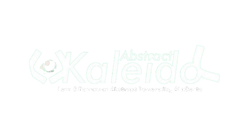

# Kaleido Agentic OS: The Autonomous Financial Layer

## Overview

**Kaleido Agentic OS** is the world's first **Unified DeFi Operating System** designed for the age of autonomous agents. Built on the **EIP-2535 Diamond Standard**, Kaleido transforms passive liquidity into an active execution environment where humans and AI agents (powered by **Luca**) interact seamlessly.

Our mission is to provide an intelligent, modular liquidity layer, merging high-performance DeFi primitives with a native reasoning engine.

---

## Key Pillars

### 1. Agentic Execution (Luca AI)
Luca is the OS's reasoning layer — provider-agnostic (Claude or OpenAI, whichever key is configured) and wired to real read tools, not a scripted demo.
*   **Local-first command routing:** A stated instruction ("swap 500 USDC to KLD", "borrow 500 USDC at 8% for 30 days") is parsed and priced deterministically, on-device, with zero model calls. The provider is reached only for things that are genuinely a reasoning question ("what's my cheapest borrow?").
*   **Metered reasoning, unmetered trading:** Model calls are rationed per wallet per day (server-enforced); a user's own trades are never capped by that limit — that cap exists to protect the shared model bill, not to restrict what you do with your own funds.
*   **Signable plans:** Whichever path answers, the result is a plan rendered for review — nothing executes until the user signs it with their own wallet.

### 2. Modular DeFi Stack
*   **V3 Concentrated-Liquidity DEX:** Swap, and open/manage LP positions with a real range picker.
*   **P2P Lending Marketplace:** Post or fill borrow requests and lending listings; deposit/withdraw collateral; repay.
*   **kfUSD Stablecoin:** Multi-collateral (USDC/USDT/USDe), minted and redeemed 1:1, backed by the kafUSD yield vault.
*   **Liquid Staking ($stKLD):** Stake KLD for a liquid, appreciating staking derivative.
*   **Buy / Sell:** Fiat on/off-ramp via MoonPay.

### 3. The Point Economy — being rebuilt, not shipped
The original points system (referrals/marketplace/LP/AI/staking/swaps) turned out to be farmable in half its inputs and is now write-locked at the database level. The replacement — server-computed, receipt-verified, time-weighted accrual — is specified in [`docs/points-system.md`](docs/points-system.md) but **not yet implemented**. Treat any point total shown today as Season 0 participation evidence, not a balance.

---

## Technical Features

*   **Next.js 14 / TypeScript**, App Router.
*   **Diamond Standard (EIP-2535):** modular, upgradeable smart contract core, deployable across EVM chains.
*   **thirdweb** for wallet connection (MetaMask, Rainbow) and chain management; **ethers v6** for all contract calls.
*   **Supabase**, service-role-gated for anything that spends a shared resource (model quota, points); anon-key reads stay public where the data is meant to be (activity feed, leaderboard).

---

## Smart Contracts (Abstract Testnet)

Addresses below are the ones the app is currently wired to — see [`.env.example`](.env.example) for the complete, authoritative list (RPCs, faucet, oracle, etc.), since these get redeployed and drift is real.

- **Diamond**: `0x7286F2708f8f4d0a1a1b6c19f5D14AdB4c3207B2`
- **KLD (native token)**: `0x0c61dbCF1e8DdFF0E237a256257260fDF6934505`
- **KLD Vault (staking)**: see `NEXT_PUBLIC_KLD_VAULT_ADDRESS`
- **kfUSD (stablecoin)**: `0x913f3354942366809A05e89D288cCE60d87d7348`
- **kafUSD (yield vault)**: `0x601191730174c2651E76dC69325681a5A5D5B9a6`
- **USDC collateral**: `0x572f4901f03055ffC1D936a60Ccc3CbF13911BE3`

---

## Development

### Installation
1. Clone: `git clone https://github.com/kaleidofinance/Kaleido-os.git`
2. Copy `.env.example` to `.env` and fill in the values you need (see comments in the file — the AI provider and MoonPay keys are optional; the app degrades gracefully without them).
3. Install: `npm install`
4. Start: `npm run dev` (or `npm run dev:turbo` for a substantially faster cold compile)

---

## Roadmap

- [x] V3 DEX, P2P lending, kfUSD/kafUSD, liquid staking — shipped, live on the Trade/Pool/Borrow/Stable/Stake surfaces
- [x] Luca: provider-agnostic agent layer with real read tools
- [x] Local-first command routing — trading works even when the model is unreachable or a wallet's quota is exhausted
- [ ] Server-verified, time-weighted points system (spec written, not implemented — see `docs/points-system.md`)
- [ ] Cross-Chain Liquidity Bridges
- [ ] Agentic Mobile Interface

---

Built by the Kaleido Team. **Deploy, Stake, and Reason.**